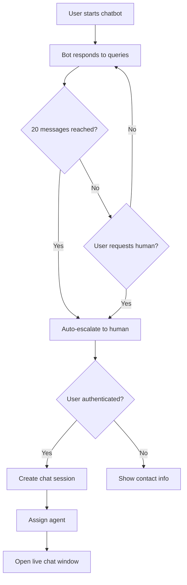

# 🚀 Role-Based Support Chat System Implementation

## 📋 Overview

This implementation provides a comprehensive role-based support chat system that integrates seamlessly with the existing chatbot. The system allows customers to escalate from bot conversations to human support agents while maintaining security and role-based access control.

## 🏗️ Architecture

### **Core Components**

1. **Enhanced Chatbot** (`src/components/utils/Chatbot.jsx`)
   - Integrated with PocketBase authentication
   - Automatic escalation after 20 messages
   - Manual escalation on user request
   - Seamless transition to human support

2. **Chat Service** (`src/services/chatService.js`)
   - PocketBase integration layer
   - Role-based agent assignment
   - Real-time messaging
   - Session management

3. **Support Chat Interface** (`src/components/support/SupportChat.jsx`)
   - Real-time chat interface for agents
   - File attachment support
   - Message history
   - Session status management

4. **Support Dashboard** (`src/app/(software)/gol/(after_login)/support/page.jsx`)
   - Agent dashboard for managing multiple chats
   - Session statistics
   - Quick actions and guidelines

## 🔐 Security & Role-Based Access

### **User Roles**
- **Customer**: Can create chat sessions, send messages
- **Merchant**: Can create chat sessions, send messages
- **GOLStaff**: Can respond to chats, manage sessions
- **GOLMod**: Can respond to chats, manage sessions, delete sessions
- **Root**: Full access to all chat functionality

### **PocketBase Collection Rules**

#### Chat Sessions (`chat_session`)
```javascript
// List/View: Users can see their own sessions or assigned sessions
listRule: "user.id = @request.auth.id || agent.id = @request.auth.id"

// Create: Only authenticated users
createRule: "@request.auth.id != ''"

// Update: Session participants or GOL staff
updateRule: "user.id = @request.auth.id || agent.id = @request.auth.id || @request.auth.role = 'GOLStaff' || @request.auth.role = 'GOLMod' || @request.auth.role = 'Root'"

// Delete: Only GOL moderators and above
deleteRule: "@request.auth.role = 'GOLMod' || @request.auth.role = 'Root'"
```

#### Messages (`messages`)
```javascript
// List/View: Users can see messages from accessible sessions
listRule: "chat.user.id = @request.auth.id || chat.agent.id = @request.auth.id"

// Create: Only session participants
createRule: "@request.auth.id != '' && (chat.user.id = @request.auth.id || chat.agent.id = @request.auth.id)"

// Update: Only message sender
updateRule: "sender.id = @request.auth.id"

// Delete: Message sender or GOL staff
deleteRule: "sender.id = @request.auth.id || @request.auth.role = 'GOLStaff' || @request.auth.role = 'GOLMod' || @request.auth.role = 'Root'"
```

## 🔄 Chat Flow

### **1. Bot to Human Escalation**


### **2. Agent Assignment Logic**
- **Customer/Merchant requests**: Assigned to GOLStaff, GOLMod, or Root
- **Priority**: First available agent (FIFO)
- **Fallback**: Manual assignment by supervisors

### **3. Real-time Communication**
- PocketBase real-time subscriptions
- Automatic message updates
- Typing indicators
- Connection status monitoring

## 📁 File Structure

```
src/
├── components/
│   ├── support/
│   │   ├── SupportChat.jsx          # Main chat interface
│   │   ├── ChatSessionsList.jsx     # Sessions management
│   │   ├── FAQManager.jsx           # FAQ management
│   │   ├── SupportButton.jsx        # Navigation support button
│   │   └── SupportWidget.jsx        # Floating support widget
│   └── utils/
│       └── Chatbot.jsx              # Enhanced chatbot
├── services/
│   └── chatService.js               # PocketBase integration
├── hooks/
│   └── useChat.js                   # Chat functionality hook
└── app/(software)/
    ├── support/
    │   ├── page.jsx                 # Main support center page
    │   └── chat/[sessionId]/
    │       └── page.jsx             # Individual chat page
    └── gol/(after_login)/support/
        └── page.jsx                 # Agent support dashboard

Backend/
└── pb_migrations/
    └── 1749900000_update_chat_collections_rules.js
```

## 🚀 Features

### **Enhanced Chatbot**
- ✅ 20-message automatic escalation
- ✅ Manual escalation on request
- ✅ Authentication-aware responses
- ✅ Seamless transition to live chat
- ✅ Visual status indicators
- ✅ Conversation history preservation

### **Support Chat System**
- ✅ Real-time messaging
- ✅ File attachments
- ✅ Message timestamps
- ✅ Typing indicators
- ✅ Session status management
- ✅ Agent assignment
- ✅ Role-based permissions

### **Agent Dashboard**
- ✅ Multiple chat management
- ✅ Session statistics
- ✅ Search and filtering
- ✅ Quick actions
- ✅ Agent guidelines
- ✅ FAQ management

### **Customer Support Access**
- ✅ Dedicated support center page (`/support`)
- ✅ Direct chat session creation
- ✅ Chat history and session management
- ✅ Support resources and contact information
- ✅ Floating support widget on all pages
- ✅ Navigation support button
- ✅ Role-based access and redirects

## 🔧 Setup Instructions

### **1. Database Migration**
Run the PocketBase migration to set up collection rules:
```bash
# The migration file is already created at:
# Backend/pb_migrations/1749900000_update_chat_collections_rules.js
```

### **2. Environment Variables**
Ensure your `.env.local` includes:
```env
NEXT_PUBLIC_PB_URL=https://api.linkmylogistics.com
```

### **3. Dependencies**
All required dependencies are already included in the project:
- `pocketbase` - PocketBase client
- `sonner` - Toast notifications
- `lucide-react` - Icons

## 📱 Usage

### **For Customers/Merchants**

#### **Option 1: Direct Support Access**
1. Visit `/support` page directly
2. Click "Start New Chat Session" to begin
3. View and continue existing chat sessions
4. Access support resources and contact information

#### **Option 2: Chatbot Escalation**
1. Start conversation with chatbot
2. After 20 messages or manual request, escalation is offered
3. If logged in, live chat session opens automatically
4. If not logged in, contact information is provided

#### **Option 3: Support Widget**
1. Use the floating support widget on any page
2. Quick access to start new chats or view recent sessions
3. Available on all pages except support pages

### **For GOLStaff/Agents**
1. Access support dashboard at `/gol/support`
2. View all assigned chat sessions
3. Click on session to start responding
4. Use real-time chat interface
5. Close sessions when resolved

### **For Administrators**
1. Access support dashboard with full permissions
2. Manage FAQ database
3. View all chat sessions
4. Assign/reassign agents
5. Monitor support metrics

## 🔒 Security Considerations

1. **Authentication Required**: All chat operations require valid authentication
2. **Role-Based Access**: Strict role checking at database and application level
3. **Session Isolation**: Users can only access their own sessions or assigned sessions
4. **Data Validation**: Input sanitization and validation on all operations
5. **Audit Trail**: All chat actions are logged with timestamps and user information

## 🎯 Benefits

1. **Seamless Integration**: Works with existing chatbot and authentication
2. **Scalable**: Can handle multiple concurrent chat sessions
3. **Secure**: Role-based access control ensures data privacy
4. **Real-time**: Instant message delivery and updates
5. **User-Friendly**: Intuitive interface for both customers and agents
6. **Maintainable**: Clean architecture with separation of concerns

## 🔮 Future Enhancements

1. **Chat Analytics**: Detailed metrics and reporting
2. **Automated Responses**: AI-powered suggested responses
3. **Chat Routing**: Advanced agent assignment algorithms
4. **Mobile App**: Native mobile chat interface
5. **Integration**: Connect with external support tools
6. **Multilingual**: Support for multiple languages

## 📞 Support

For technical support or questions about this implementation, contact the development team or refer to the PocketBase documentation for database-related queries.
